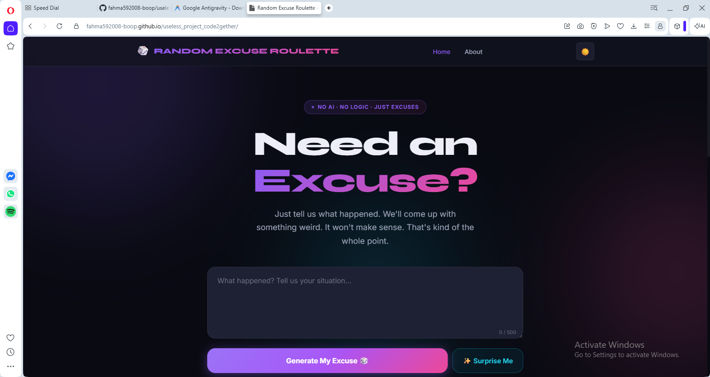
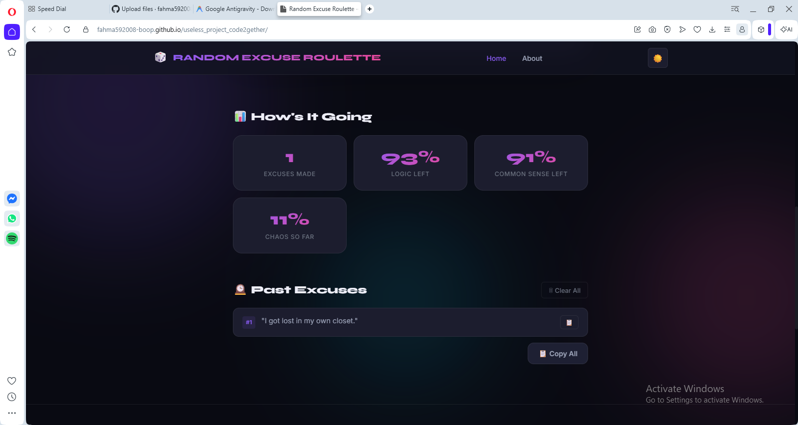
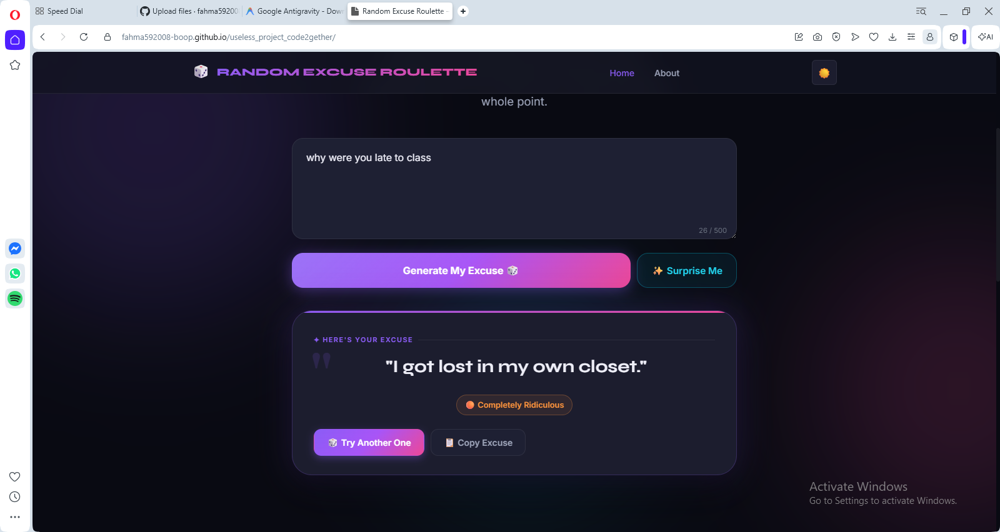

# [Random Excuse Roulette] 🎯

## Basic Details
### Team Name: [Code2gether]

### Team Members
- Member 1: [ROSHNA KP] - [Ilahia College Of Engineering]
- Member 2: [Fahma Anver Sha] - [Ilahia College Of Engineering]

### Project Description
[a website which gives you a random and irrelevant excuse when you give a situation]

### The Problem (that doesn't exist)
[lack of irreasonable excuses to various situations ]

### The Solution (that nobody asked for)
[generating weirdest excuses to the randomest situations]

## Technical Details
### Technologies/Components Used
For Software:
- [HTML5, CSS3, JavaScript (ES6)]
- [ None (Vanilla)]
- [ Google Fonts (Inter, Syne)]
- [ Web Browser, Text Editor (e.g., VS Code)]

For Hardware:
- [ Web Browser, Text Editor (e.g., VS Code)]
- [Any modern web-capable device specifications]
- [No specific hardware tools required]

### Implementation
For Software:
# Installation
[No installation commands required. Simply download or clone the project containing `index.html`.]
# Run
[Open `index.html` directly in any modern web browser (e.g., Chrome, Firefox, Safari, Edge).
No build tools or local servers are strictly necessary since it is a standalone file.]

### Project Documentation
For Software:This project is a single-page application called "Random Excuse Roulette." It allows users to type in a situation and generates a random, humorous excuse. All logic, styling, and markup are contained within a single `index.html` file, leveraging vanilla HTML, CSS for styling (including custom properties and CSS animations), and inline JavaScript for logic and interactivity (such as clipboard integration and history tracking).

# Screenshots (Add at least 3)

*Add caption explaining what this shows*

*Add caption explaining what this shows*

*Add caption explaining what this shows*

## Team Contributions
- [Fahma Anver Sha]: [UI AND UX]
- [ROSHNA KP]: [BACKEND AND WORKING]

---
Made with ❤️ at TinkerHub Useless Projects 

